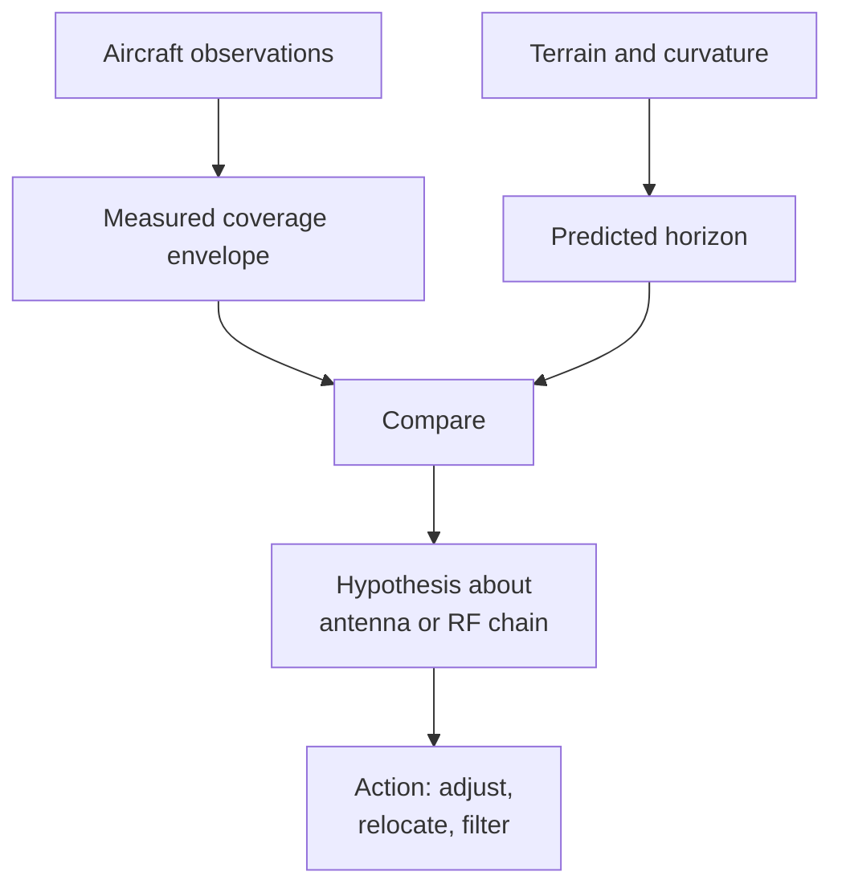
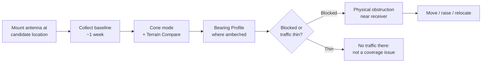
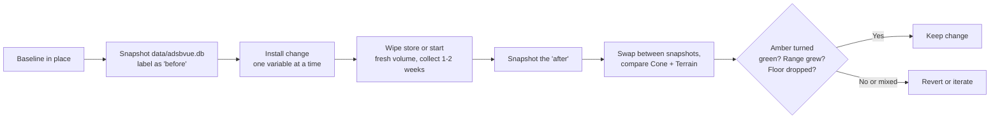
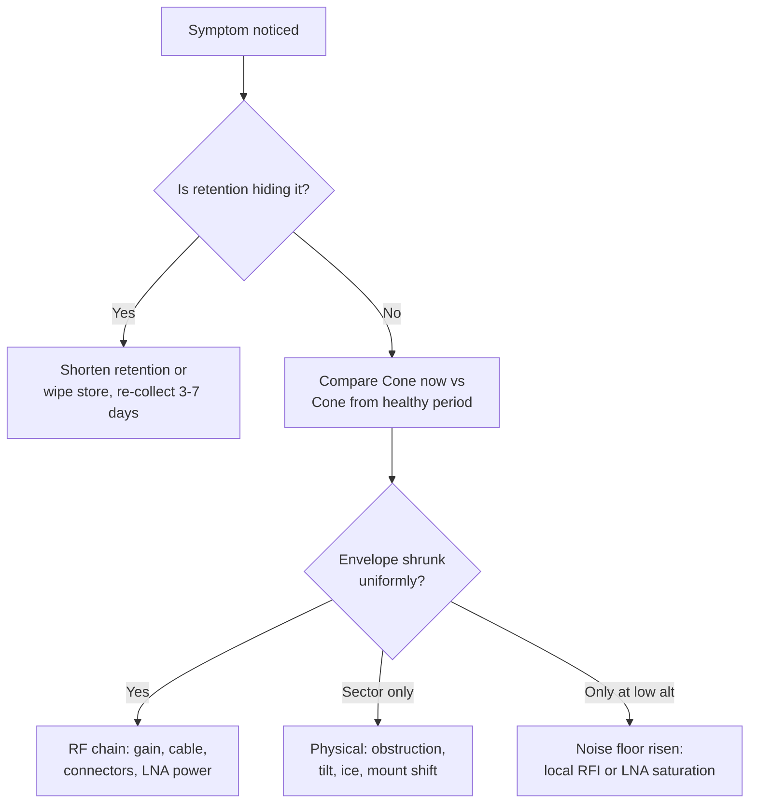

# ADSb-Vue: best practices

A practical guide to using ADSb-Vue as a diagnostic tool rather than a
visualization. If you have it running from the [README](README.md) and want
to actually use it: to place an antenna, troubleshoot reception, or evaluate
whether an intentional change made things better, this is that guide.

## What makes this different from other viewers

Most ADS-B tools show you what you heard. ADSb-Vue also shows you what your
site should be able to hear based on terrain and the earth's curvature, then
lets you compare the two directly.

That comparison, measured against predicted, is the thing to focus on. It
turns the tool from a visualization into something closer to a hypothesis
tester: you form a theory about your antenna's coverage (or a problem you
think you have), then check whether Terrain Compare, the Bearing Profile,
and the Cone floor agree with it. Most of the workflows in this document
use that pattern.

## What the tool actually shows (and doesn't)

ADSb-Vue is a *coverage envelope* of received ADS-B signals over time: where
your antenna can hear planes from. It is not a traffic replay, an activity
monitor, or a live tracking display.

The distinction matters more than it sounds:

- Every cell (a bin in bearing by distance by altitude) that has ever been
  heard during the retention window stays lit. The timeline animation
  reveals cells in the order they were first heard, and they never fade.
- A single ping at 3am counts the same as an hour of steady traffic through
  the same cell. Both light one dot.
- Density (in Voxel mode) uses `log(count)`, so heavily used corridors are
  brighter than isolated detections, but the reveal is still by first seen
  time.

If air traffic dropped 90% for a month, the render would look nearly
unchanged during that month: every cell was already seen. That is by design.
The tool is answering "where does your antenna have coverage?" and not "how
busy is the sky right now?"

### The three render modes, one question each

| Mode | Question it answers |
| --- | --- |
| Points | Every place I have ever heard a plane from: the raw set of positions. Good for spotting isolated detections, coverage gaps, and unusual events. |
| Voxel (density) | Where do planes concentrate? Bright cells are heavily used corridors; dim cells are edges or isolated detections. Good for identifying arrival and departure routes and busy sectors. |
| Cone (coverage floor), with Terrain Compare | The lowest altitude I can hear at each bearing and distance, compared against what terrain and the earth's curvature predict. Green cells mean you match the theoretical horizon (excellent). Blue means you exceed it (very good, often ducting or an unusually favorable RF path). Amber means the lowest plane you heard was higher than the terrain-limited horizon predicts. Grey means no low altitude traffic flew through, so there is no data to grade. |

> **Read this once:** grey is not bad. Grey means "no low altitude traffic
> flew through this direction while you were listening, so we cannot judge
> your coverage there." You may have excellent coverage in a grey sector,
> or none at all; the tool has no evidence either way. This is the most
> common misreading of the Terrain Compare display.

If you look at only one mode, look at Cone with Terrain Compare on. Points
and Voxel are descriptive; the Terrain Compare is where "why is my
reception like this?" gets answered.

## Choosing a retention window for what you are doing

Retention (`ADSB_RETAIN_DAYS`, which requires persistence via `ADSB_DATA_DIR`)
sets how long a cell survives without being re heard before it is pruned.
That decision shapes what the tool can tell you.

| Use case | Suggested retention | Why |
| --- | --- | --- |
| Casual "what does my coverage look like?" | 30 days | The coverage envelope converges within a couple of weeks; a month is comfortable headroom without disk cost. |
| Antenna placement A/B | 60 days | Enough for a clean "before" baseline (2 to 3 weeks) plus a comparable "after." |
| Long term drift or degradation baseline | 180+ days | Slow LNA decay, cable water damage, ice induced tilt: these need multi month baselines to notice against. |
| Seasonal comparison | 365 days | Winter and summer aviation are genuinely different: VFR sightseeing, weather deviation routes, holiday spikes. |
| Rare event capture (ducting, unusual altitudes) | 365 days | Preserve those "once every few weeks" edge cells that would otherwise age out. |

Rule of thumb: the visual coverage envelope converges fast (days to a few
weeks). Long retention pays off for comparative work: comparing periods,
spotting drift, catching rare events. If you are not doing that, 30 days is
fine.

> **Common mistake:** troubleshooting a real reception problem with the
> default 30 day retention still active. Old cells hide fresh degradation.
> When actively debugging, shorten retention temporarily (7 days), or wipe
> `data/adsbvue.db` and let a clean baseline rebuild. You want the view to
> reflect current reality, not months old memories of a healthy antenna.

## Workflow: analyzing antenna placement

You have a candidate mount location (or several) and you want to know how
each performs before you commit. The general shape:

Step by step:

1. **Mount and collect a baseline.** Give it at least 5 to 7 days. Weekday
   traffic differs from weekend; morning and evening pushes populate
   different corridors. Anything less and you are diagnosing your own
   sampling gaps.
2. **Switch to Cone mode.** This is where terrain and obstruction problems
   become visible as raised floors.
3. **Turn on Terrain, Compare to horizon.** Interpret the colors as
   evidence, not scores: green is confirmed evidence of good coverage; blue
   is confirmed evidence of exceeding prediction; amber is a signal to
   investigate further; grey is absence of evidence.
4. **Do not judge amber blindly.** Amber can mean a real gap, or it can
   mean "no low traffic happened to fly there." Use the Bearing Profile to
   tell them apart: click that bearing, look at where the hits fall
   relative to the horizon line.

   > **Good sign:** hits trace the horizon line. Your antenna is at its
   > terrain and curvature limit in that direction. Nothing to fix.
   >
   > **Watch for:** an empty low region with hits only appearing at 8k
   > feet and above. That direction is genuinely blocked. Something is in
   > the way physically.
5. **Also turn on HWT range rings** if you have set a HeyWhatsThat
   panorama ID. HWT is an independent horizon model, useful as a cross
   check. If both models agree the floor should be low and you are only
   hearing high, that is a real obstruction or an RF chain problem, not
   modeling error.

> **What good looks like:**
>
> - Cone is a smooth bowl, low near receiver, rising with distance.
> - Terrain Compare is mostly green in the busy arrival and departure
>   corridors.
> - HWT rings sit right on the coverage boundary at their altitudes.
> - Points and voxel show clear route structure (STARs and SIDs).

> **What a placement problem looks like:**
>
> - Cone has a persistent wedge: a sector where the floor is much higher
>   than adjacent sectors.
> - Terrain Compare shows amber in a corridor you *know* is busy (arrivals
>   from that direction).
> - Bearing Profile: low region is empty, hits only appear at 8k+.
> - The pattern does not change with time. It is not sampling, it is
>   systematic.

That is the antenna. Move it, raise it, get it above whatever is blocking
that sector, or accept the tradeoff and pick a different mount.

## Workflow: running controlled experiments

Once your setup works, most of what you will do with ADSb-Vue is
experiments: install a new mast, swap an antenna, add a filter, try a
different gain setting, and see whether the change actually improved
things. The tool is designed for this.

The rules of a clean experiment:

- **Change one thing.** New mast height *and* new antenna type *and* new
  cable is three variables. You will not know which mattered. Split them.
- **Give each phase enough time.** One to two weeks minimum per condition.
  The coverage envelope needs to converge before comparison is meaningful.
- **Snapshot the SQLite store.** `cp data/adsbvue.db data/adsbvue-before.db`
  is the whole ceremony. Do it at the end of "before" and at the end of
  "after." To compare, stop the container, swap the file in as
  `adsbvue.db`, restart, look. Swap back.
- **Compare qualitatively first.** Where did the Terrain Compare go from
  amber to green? Where did the Cone floor drop? Are new bearings covered
  that were dark before?
- **Use the Bearing Profile to confirm the mechanism.** If the change
  was "raise the mast 20 feet," the profile in previously blocked
  directions should now show hits reaching lower. If the change was "add a
  bandpass filter," floors should not have moved, but distant edge cells
  should get cleaner (fewer isolated far cells at low altitudes).

> **Common mistake:** declaring victory after 48 hours. If the "before"
> was a mature 30 day envelope and the "after" is 48 hours, the "after"
> will look worse just because it has less data. Wait until convergence.

> **Common mistake:** treating range expansion as the only metric. A
> setup that hears an occasional 400 nm event is not necessarily better
> than one that reliably hears 250 nm continuously. Look at the density
> mode: what got denser is more meaningful than what got farther.

Quantitative comparison ("floor at bearing 275 degrees dropped from 4200
feet to 2800 feet") requires reading the underlying database directly; the
visual is not built for that yet.

## Workflow: troubleshooting reception problems

Something used to work and now does not, or you are not getting the range
or coverage you expected.

Common symptom patterns and what they usually mean:

**Envelope shrunk everywhere, Cone floor higher across all bearings.**
Uniform loss of sensitivity. The RF chain has degraded. Check:

- Gain settings (something got reset?)
- Coax connectors (water, corrosion, oxidation)
- LNA (still getting bias voltage, if inline)
- Receiver (dropped USB reads, SDR overheating)

**Envelope intact but sector missing or raised floor in one direction.**
Physical change to what the antenna can see. Check:

- Something built or grown up in that direction (construction, foliage
  growing, snow accumulation on a nearby roof)
- Antenna itself tilted, rotated, or leaning
- Ice or water on the antenna or connector
- Something metallic added nearby (satellite dish, HVAC unit, chimney cap)

**Coverage envelope fine, but low altitude hits vanishing.** Noise floor
has risen. You can still hear strong signals, but the weakest (farthest
and lowest) are lost in the noise. Check:

- New RF source nearby (neighbor's LED bulbs, cheap switching supplies, a
  solar inverter)
- LED, plasma, or fluorescent lighting on same circuit
- LNA saturating from an out of band signal (cell tower, pager, broadcast
  FM). Consider a bandpass filter.
- Receiver gain too high. Paradoxically, reducing gain can improve weak
  signals if you were previously saturated.

**Coverage envelope fine, live listen intermittent, hit rate erratic.**
Downstream problem, not RF. Check:

- USB cable and hub quality
- Receiver host software (dump1090, readsb) restarted cleanly
- Feeder network reachability if using a remote SDR

**Nothing at all, dead.** Not really an ADSb-Vue diagnostic. Check the
feeder health first. `/status` on the daemon and the feeder's own web UI
tell you if data is flowing before you look at ADSb-Vue.

## Sanity limits: what this tool will not tell you

Being clear about the ceiling of the tool saves you from over interpreting:

- **Activity levels.** A busy hour and a dead hour look the same in the
  render if the same cells were seen in both. Use the feeder's own message
  rate graphs for that.
- **Which specific plane or flight was heard.** Data is aggregated into
  spatial cells at ingest; individual aircraft identity is not preserved.
- **Real time visibility.** The view is a coverage envelope built from
  history, not a live map. Use tar1090 for live traffic.
- **Signal strength.** Cells are binary (heard or not heard) at each
  point of view. Weak but decodable and strong signals contribute
  equivalently.
- **What broke, exactly.** The render shows the *symptom*, not the cause.
  It will tell you "the floor rose in sector 270 to 310 degrees over the
  last month." You still have to walk out with a ladder and figure out
  why.
- **Traffic outages or one off quiet periods.** Because of the cumulative
  reveal, a 30 day shutdown looks like a normal 30 day period unless
  retention was short enough for cells to age out.

None of these are limitations of ADS-B. They are consequences of the
"coverage envelope" framing. Different questions need different tools.

## Common mistakes and misreadings

Ordered by how often they trip people up:

**"My Cone stopped changing after two weeks. Is something broken?"**
No. The coverage envelope converges. Once your antenna has heard everything
it routinely can, additional weeks add very little. This is expected
behavior, not a failure. Long retention is for comparative work, not for
"waiting for it to get better."

**"Amber means bad reception."**
No. Amber means "the lowest aircraft that flew through here was higher than
the terrain-limited horizon predicts was possible." That could be a real obstruction, or it could
just be that no low traffic passed through that sector during the window.
Use the Bearing Profile to disambiguate: hits tracing the horizon line
say the terrain-limited horizon is the ceiling; an empty low region with hits only at
altitude says something is in the way.

**"Grey means bad reception, or a gap."**
No, and this is the misreading most likely to send you on a wild chase.
Grey means "no low altitude traffic flew here, so we have no evidence to
grade this direction." You might have excellent coverage there. You might
have none. The tool is not making a claim either way.

**"Blue means the terrain model is wrong."**
Not necessarily. Blue means you are hearing aircraft below the theoretical
horizon. Most often this is real: atmospheric ducting, favorable RF paths,
or a temporary inversion. Occasionally it is a bit corrupted altitude
decode; if you see one or two isolated blue cells at implausible altitudes
far from busy corridors, that is the likely cause.

**"Traffic dropped yesterday but nothing changed in the render."**
Correct, and by design. The render is the coverage envelope, not activity.
An outage or slow day is invisible unless you have very short retention and
the cells age out. Use the feeder's message rate graphs to see live
activity.

**"I moved the antenna and coverage got worse."**
Give it time. A "before" from a mature 30 day envelope compared against a
48 hour "after" always makes the after look worse. Wait for convergence
before deciding.

**"I need to leave this running for a year to get a good picture."**
No, unless you are doing seasonal or drift work. The routine coverage
picture is done in a couple of weeks. Long retention is a tool for
comparative work.

**"Isolated far low altitude cells mean my range is amazing."**
Probably not. Line of sight to a 5000 foot aircraft from a typical
receiver is about 125 to 140 nm. Isolated cells far beyond that, at low
altitudes, are usually bit corrupted altitude decodes: real cruise
aircraft whose altitude field flipped a bit on a weak decode and landed
in the wrong bin. The `ADSB_LOS_FILTER` server option rejects these at
ingest if you want them gone.

## A minimal checklist for a healthy setup

If you want a quick "is my ADSb-Vue picture consistent with a healthy
receiver?" check:

- [ ] Cone floor is smooth and rises monotonically with distance
- [ ] Terrain Compare is mostly green in your busiest corridor
- [ ] HWT range rings match the Cone edges at their altitudes
- [ ] Voxel brightness pattern looks like known STARs and SIDs
- [ ] Max range roughly matches the site's HeyWhatsThat prediction
- [ ] Points cover the full 360 degrees (unless you have a known sector
      blockage)
- [ ] After a week, adding another week barely changes the envelope

If most of these check out, your antenna is doing what it should. If
several do not, the workflows above are where to start.
